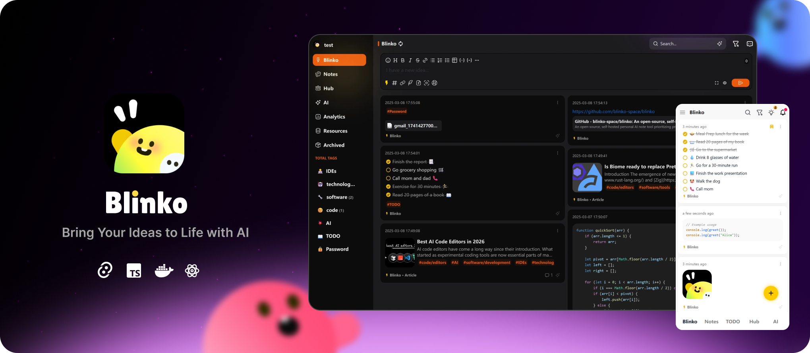

<h1 align="center">Blinko</h1>

<div align="center">


</div>

<div align="center">

[Live Demo](https://demo.blinko.space) •
[Official Site](https://blinko.space) •
[Documents](https://docs.blinko.space/) •
[Telegram Chinese](https://t.me/blinkoChinese) •
[Telegram English](https://t.me/blinkoEnglish) •
[中文](README.zh-CN.md)
</div>

> Live Demo: username:blinko password:blinko


Blinko is an AI-powered card note-taking project. Designed for individuals who want to quickly capture and organize their fleeting thoughts. Blinko allows users to seamlessly jot down ideas the moment they strike, ensuring that no spark of creativity is lost.

<div align="center">

[](https://www.pikapods.com/pods?run=blinko)

</div>

## 🚀Main Features
- 🤖**AI-Enhanced Note Retrieval** ：With Blinko's advanced AI-powered RAG (Retrieval-Augmented Generation), you can quickly search and access your notes using natural language queries, making it effortless to find exactly what you need.

- 🔒**Data Ownership** :Your privacy matters. All your notes and data are stored securely in your self-hosted environment, ensuring complete control over your information.

- 🚀**Efficient and Fast** :Capture ideas instantly and store them as plain text for easy access, with full Markdown support for quick formatting and seamless sharing.

- 💡**Lightweight architecture with multi-platform support** :Built with Tauri, Blinko features a clean and lightweight architecture that delivers robust performance while maintaining exceptional speed and efficiency, with native support for multi-platform deployment including macOS, Windows, Android, and Linux.

- 🔓**Open for Collaboration** :As an open-source project, Blinko invites contributions from the community. All code is transparent and available on GitHub, fostering a spirit of collaboration and constant improvement.

## 📦Start with Docker in seconds

```bash
curl -s https://raw.githubusercontent.com/blinko-space/blinko/main/install.sh | bash
```

## 👨🏼‍💻Contribution
Contributions are the heart of what makes the open-source community so dynamic, creative, and full of learning opportunities. Your involvement helps drive innovation and growth. We deeply value any contribution you make, and we're excited to have you as part of our community. Thank you for your support! 🙌

[]([...](https://github.com/blinko-space/blinko/graphs/contributors))


## Sponsorship
If you find Blinko valuable, consider supporting us! Your contribution will enable us to continue enhancing and maintaining the project for everyone. Thank you for helping us grow. If you'd like to deploy Blinko, you can also use PikaPods to support Blinko. 20% of the deployment fees generated on PikaPods will be contributed to Blinko.

[](https://www.pikapods.com/pods?run=blinko)

[https://ko-fi.com/blinkospace](https://ko-fi.com/blinkospace)

[https://afdian.com/a/blinkospace/plan](https://afdian.com/a/blinkospace/plan)

## Star History

[](https://star-history.com/#blinko-space/blinko&Date)

<div align="center">
    <a href="https://next.ossinsight.io/widgets/official/compose-last-28-days-stats?repo_id=877230294" target="_blank" style="display: block" align="center">
  <picture>
    <source media="(prefers-color-scheme: dark)" srcset="https://next.ossinsight.io/widgets/official/compose-last-28-days-stats/thumbnail.png?repo_id=877230294&image_size=auto&color_scheme=dark" width="655" height="auto">
    
  </picture>
    </a>
</div>

<div align="center">
    <a href="https://next.ossinsight.io/widgets/official/analyze-repo-stars-map?repo_id=877230294&activity=stars" target="_blank" style="display: block" align="center">
  <picture>
    <source media="(prefers-color-scheme: dark)" srcset="https://next.ossinsight.io/widgets/official/analyze-repo-stars-map/thumbnail.png?repo_id=877230294&activity=stars&image_size=auto&color_scheme=dark" width="721" height="auto">
    
  </picture>
    </a>
</div>

## FAQ
Q: Why does the MacOS device installation show as damaged?

A: macOS adds an attribute called com.apple.quarantine to apps that are not notarized when downloading or installing them. This command is used to manually remove that attribute. Run sudo xattr -rd com.apple.quarantine /Applications/blinko.app

